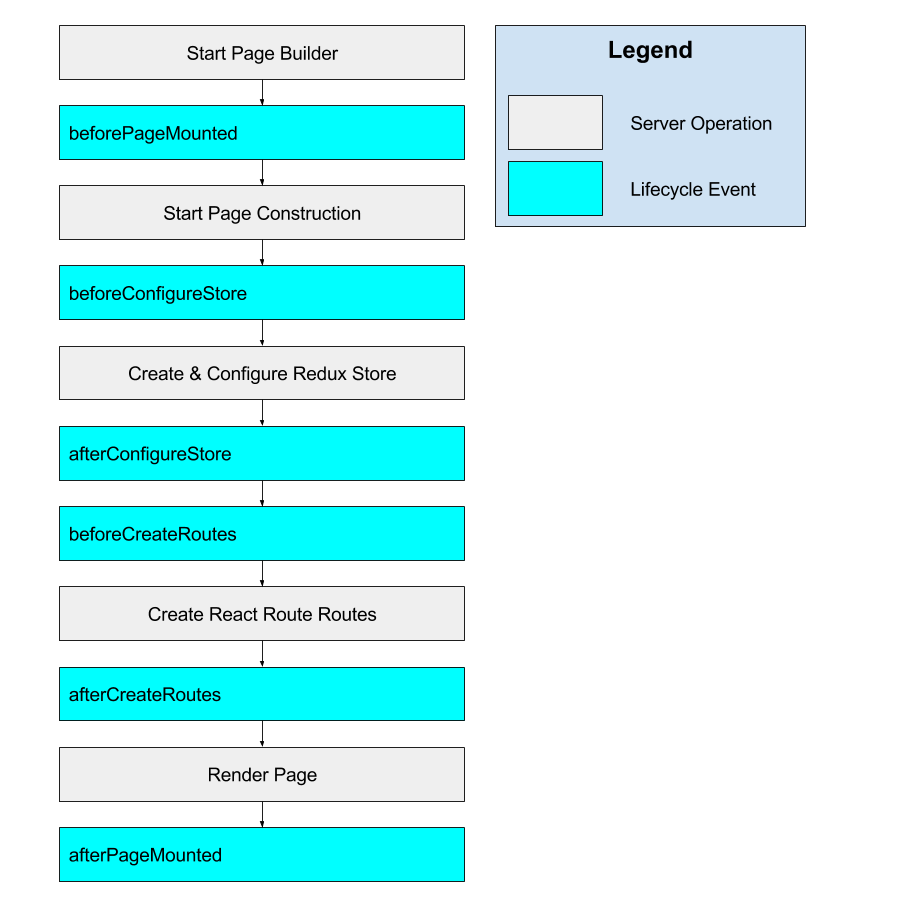

# Page Lifecycle Injectors
A key component to extending the construction of a Thunderball Page is through the use of "lifecycle injectors".  These allow you to execute custom code in response the operations that happen inside of Thunderball while constructing a web page on the client.

It is important to understand that these events run on the server when isomorphically generating the page and on the client when the browser builds its' version of the page.

##Lifecycle Events

###beforePageMounted
> Fires before the page start initializing

###beforeConfigureStore
> Fires before the redux store is configured

###afterConfigureStore
> Fires after the redux store is configured

###beforeCreateRoutes
> Fires before the react-router routes are defined

###afterCreateRoutes
> Fires after the react-router routes are defined

###afterPageMounted
> Fires after the page is initially rendered