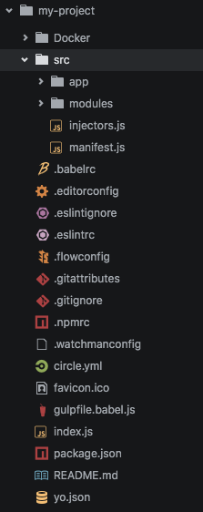

# Project Structure

## Folders and Files
- `/Docker`:
- `/src`:
  - `/app`:
  - `/ions`:
- `.babelrc`:
- `.editorconfig`: config used by editors to enforce style consistency such as spacing, character set, indenting, etc
- `.eslintignore`: files that are ignore by the linter (static code analysis)
- `.eslint`: configuration for the linter (static code analysis)
- `.flowconfig`: configuration for the [flow type system](https://flowtype.org/)
- `.gitattributes`: sets attributes for the git source control
- `.gitignore`: defines files to ignore in git source control
- `.npmrc`: configuration for [npm](http://www.npmjs.org/) to point to a custom npm repository
- `.watchmanconfig`: configuration for [watchman](https://github.com/facebook/watchman) which watches for file changes and reloads the thunderball server
- `circle.yml`: configuration for [CircleCI](/www.circleci.com) continious integration system
- `favicon.ico`: [favicon](https://en.wikipedia.org/wiki/Favicon) to use in the browser web application
- `gulpfile.babel.js`:
- `index.js`: the entry point for the application in production mode. This is what starts the thunderball server in the project
- `package.json`:
- `README.md`:
- `yo.json`:
