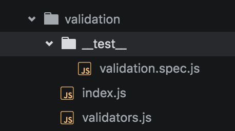

# Testing
## Testing Types
There are only 2 types of tests that will written inside of Thunderball applications:

1. **Unit Testing**: Testing the smallest possible unit of code and mocking everything else. This such as help libraries, utilities, and business logic should be 100% unit tested.
2. **Component Testing**: Testing a UI component.  This can be harder than a pure unit test, but should follow the same principles

Other types of testing such as Integration or End-to-End tests should probably live in separate projects, but that your decision and is outside the scope of basic Thunderball testing.

## Principles
1. A test should be **isolated** as much as possible. Avoid dependencies such as environment settings, register values, or databases. 
* A test should **independent** and not depend on running other tests before it, nor should it be affected by the order of execution of other tests. 
* A test should be **deterministic**. Running the same unit test 1,000 times should return the same result every time.
* Each test should be **singular**. Try to keep the number of `expect` calls in a test as close to 1 as possible.  
* Tests should be **readable** and easy to understand. Tests help serve as documentation.
* Tests **results**, not implementation.  Implementation details should always be considered a black box to a test
* Don't only test positive results, but also **test edge cases** or bad values as well. Be sure to test for `null` and `undefined`.  If you throw any exceptions, make sure you test that those exceptions get thrown when the correct conditions are met.
* **Colocate** tests with the code that's being tested. Tests should live close as possible to to code instead of some global tests folder.

##Libraries
* [Jest](https://facebook.github.io/jest/): A Facebook JavaScript and React testing framework
* [Enzyme](https://github.com/airbnb/enzyme): A testing library specifically for React that makes it easier to assert, manipulate, and traverse your React Component output. It's meant to be intuitive and flexible by mimicking jQuery's API for DOM manipulation and traversal.

## Naming and Structure
- All Tests must live in a folder named **`__test__`**.  This folder should live as close as possible to the files being tested.
- Test files themselves should follow the `**FILENAME.spec.js**` format where `FILENAME` is the name of the file or component being tested.

## Example Unit Test

## Example Component Test

