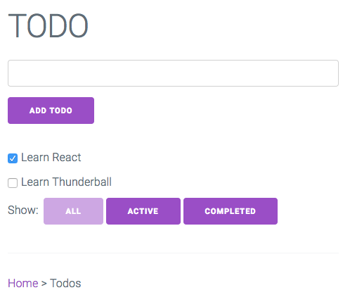
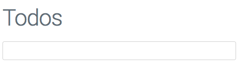
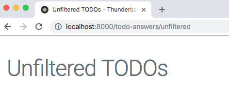
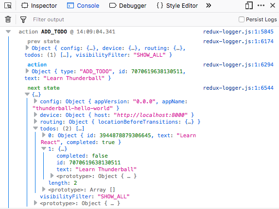
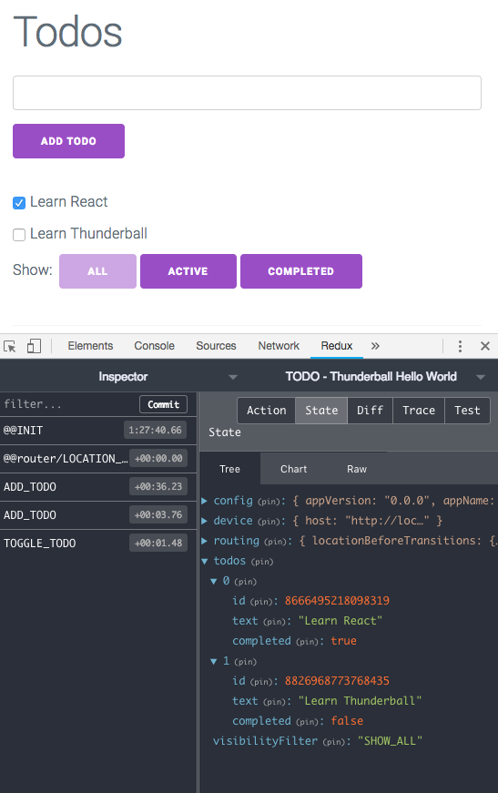
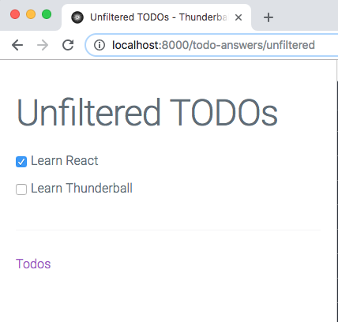
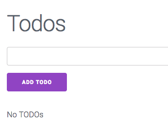
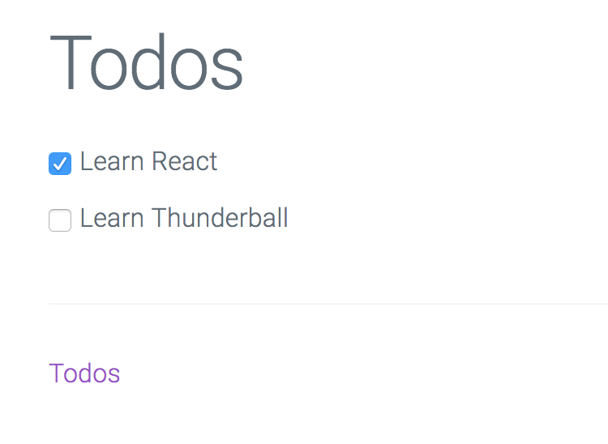

# Tutorial

This tutorial will take you through the basics of working with a Thunderball application. You will develop a simple to-do app adapted from the [Redux example](https://github.com/reduxjs/redux/tree/v4.0.0/examples/todos). Code changes to the tutorial application will be made in the `src/ions/todos` directory. Answers to all the exercises can be found in `src/ions/todos-answers`. 

## Minimal Setup
* [Node.js](https://nodejs.org/en/)

## Recommended Setup
* [Chrome web browser](https://www.google.com/chrome/)
  * [React Developer Tools](https://chrome.google.com/webstore/detail/react-developer-tools/fmkadmapgofadopljbjfkapdkoienihi)
  * [Redux DevTools](https://chrome.google.com/webstore/detail/redux-devtools/lmhkpmbekcpmknklioeibfkpmmfibljd)
* [Visual Studio Code](https://code.visualstudio.com/) or equivalent with ESLint configured


## Generate a New Thunderball App

The easiest way to get started is with our [Yeoman](https://yeoman.io/) generator. Open your terminal and type:

```sh
# install yeoman
npm install -g yo

# install the thunderball generator
npm install -g generator-thunderball

# make a new thunderball project
mkdir MYAPP && cd MYAPP
yo thunderball

# Follow prompts from the generator

# compile and run the new app
npm start

# Navigate to http://localhost:8000 in a web browser
```

You should see your new Thunderball app at http://localhost:8000.

## Running Tests

The example application comes configured for unit testing with [Jest](https://www.npmjs.com/package/jest) and [Enzyme](https://www.npmjs.com/package/enzyme). The todos ion has a number of unit tests for your reference. `npm test` runs the tests. For more advanced usage, you can use the Jest CLI directly (`npx jest ...`). A typical dev workflow involves keeping a terminal open and running `npx jest --watch --notify`. Then, Jest will monitor changes and run tests automatically on demand. Take a close look at the tests in the todos ion and you will find component render tests that make use of Jest snapshot matchers as well as more traditional unit tests using other Jest matchers for reducers or actions. You'll also find usage of Jest spies and mocking techniques that should give you a good start on unit testing in a real app.

##  Working With Views and Ions

In your web browser (http://localhost:8000) you will see the home view for your new application. Views are top level React components that are rendered based on the URL pathname. Open up `src/ions/home/containers/HomeView.jsx` and you will see the source code for the home view. Open up `src/ions/home/createRoutes.jsx` and you will see how the path `/` is routed to the `HomeView` component as an `IndexRoute` using `react-router`.

>Please note that you can use the `.js` or `.jsx` extension for your files. Thunderball supports either. This tutorial uses a mix of extensions to illustrate the point.

Now, click on the [TODO App](http://localhost:8000/todos). You should now see the Todos view (`src/ions/todos/containers/TodoView.js`). We'll be working in this view and sub routes for much of the tutorial. Take a minute and add some todos. Check off some of your todos and try out some of the visibility filters.



You'll notice that the Home view was located within the `src/ions/home` directory and this Todos view is located within the `src/ions/todos` directory. These two Thunderball `Ions` (or modules) in this case each contain the code for a separate single page application (SPA). Each ion delivers a single page to the browser. In other cases Ions can configure [express](https://www.npmjs.com/package/express) middleware, serve static assets, or otherwise extend/configure a Thunderball app.

## Modify an Existing View

Thunderball supports hot module reloading (HMR). This enables the web browser to automatically update and reflect changes as you modify your code. For this to work your view component must be exported as `hot` using `react-hot-loader` as shown in the follow snippet.

```js
import { hot } from 'react-hot-loader';

const MyView = () => (
  <div>
    My View
  </div>
);

export default hot(module)(MyView);
```

Open `src/ions/todos/components/App.js` and change the `defaultMessage` nested inside the `<h1>` from "TODO" to "Todos". You should see the new heading in the web browser without reloading the browser. Note that `App` is not a `hot` component but its parent TodoView is `hot`.



## Add a New Route

As discussed previously the todos ion is a SPA (single page application). It needs to register one or more routes (with corresponding view components) with Thunderball so that Thunderball knows which component to render based on the URL. Note that this rendering could take place on the server from an actual page request (as when your user first arrives on your site or follows a link between ions), or it could be a route transition in the browser without making an actual server request (linking within your ion with a [react-router](https://github.com/ReactTraining/react-router/tree/v3.2.1) `Link`).

Routes are declared in a routes file such as `src/ions/todos/createRoutes.js` using `react-router` (v3). Thunderball needs to know where to find the ion routes file. This and other ion configuration goes in the ion manifest file `src/ions/todos/manifest.js`.
```js
// manifest.js
const basePath = '/todos';

export default {
  name: 'todos',
  browser: {
    page: {
      createRoutes: './createRoutes',
      path: `${basePath}*`,
      injectors: [
        '../../appInjectors',
        './injectors',
      ],
      props: {
        basePath,
      },
    },
  },
};
```

The value of `createRoutes` is the relative path to the routes file. Note that the routes file can have any name (it does not need to be called `createRoutes`.

The `path` value in the manifest file is used by Thunderball as the base path for your routes when matching routes on the server. In general it will be the same top level path you define in the `createRoutes` appended with the `*` wildcard. As a convenience, this tutorial makes use of a `basePath` variable wherever possible to follow the DRY (don't repeat yourself) principle.

Adding a new view requires
1. Creating the new component
2. Adding a `Route` to the new component in the `createRoutes` file.

You will now create a new view within the todos ion that displays all the todos without any filtering options.

Follow these steps:
1. Create a file `src/ions/todos/containers/UnfilteredTodoView.js`
```js
  import React from 'react';
  import { hot } from 'react-hot-loader';

  const TodoView = () => (
    <div>
      <h1>
        Unfiltered TODOs
      </h1>
    </div>
  );

  export default hot(module)(TodoView);
```
2. Import the new component in the createRoutes file
```js
import UnfilteredTodoView from './containers/UnfilteredTodoView';
```
3. Declare the route at path "unfiltered"
```js
<IndexRoute component={TodoView} />
<Route path="unfiltered" component={UnfilteredTodoView} />
```
4. Navigate to http://localhost:8000/todos/unfiltered to verify the view is working

## Add Document Head Content with react-helmet-async

Views are rendered into the `<body>` element of the DOM via `react-dom`. However, for SEO and other purposes `<head>` content needs to be dynamically generated as well. [react-helmet-async](https://www.npmjs.com/package/react-helmet-async) can be used for this purpose. Simply import `react-helmet-async` and use it within your component. Thunderball creates a Helmet provider behind the scenes so no additional configuration is needed.

Let's add a title to the new UnfilteredTodoView.
1. Import `react-helmet-async`
```js
import Helmet from 'react-helmet-async';
```
2. Add a Helmet component with a child `<title>` tag to the component
```js
<div>
  <Helmet>
    <title>
      Unfiltered TODOs
    </title>
  </Helmet>
```

UnfilteredTodoView code should now look like this
```js
import React from 'react';
import { hot } from 'react-hot-loader';
import Helmet from 'react-helmet-async';

const UnfilteredTodoView = () => (
  <div>
    <Helmet>
      <title>
        Unfiltered TODOs
      </title>
    </Helmet>
    <h1>
        Unfiltered TODOs
    </h1>
  </div>
);

export default hot(module)(UnfilteredTodoView);
```

The browser should reload, and the tab should now display your new title



The full title of "Unfiltered TODOs - Thunderball Hello World" is displayed instead of simply "Unfiltered TODOs". This is due to the Helmet `titleTemplate` specified in `src/containers/App.jsx`.

> Since a key feature of Thunderball is server-side rendering which may involve asynchronous data fetching we rely on [react-helmet-async](https://www.npmjs.com/package/react-helmet-async) instead of the more popular [react-helmet](https://www.npmjs.com/package/react-helmet). See [react-helmet-async README](https://github.com/staylor/react-helmet-async/blob/master/README.md) for details. If you only plan to use Thunderball without server-side rendering `react-helmet` can be used in your components to set `<head>` content in the browser only.

## Link to the New View

Links within ion views are created using the [react-router](https://www.npmjs.com/package/react-router) `Link` component. This renders the `<a>` into the DOM but does so in a way that when clicked it does not make a server request for a new page.

Let's link from the main todos view to the new unfiltered todos view.
1. Open `src/ions/todos/components/App` and import `Link` from `react-router`
```js
import { Link } from 'react-router';
```
2. Import the basePath variable from the constants file
```js
import { basePath } from '../constants';
```
3. Replace the `<a` with `<Link>` in the App render function
```js
<Link to={`${basePath}/unfiltered`}>
  Unfiltered Todos
</Link>
```

Your App component should now contain the following.
```js
import React from 'react';
import { FormattedMessage } from 'react-intl';
import { Link } from 'react-router';
import Footer from './Footer';
import AddTodo from '../containers/AddTodo';
import VisibleTodoList from '../containers/VisibleTodoList';
import { basePath } from '../constants';

const App = () => (
  <div>
    <h1>
      <FormattedMessage
        id="app.title"
        description="app title"
        defaultMessage="Todos"
      />
    </h1>
    <AddTodo />
    <VisibleTodoList />
    <Footer />
    <hr />
    <Link to={`${basePath}/unfiltered`}>
      Unfiltered Todos
    </Link>
  </div>
);

export default App;
```

You should now be able to navigate to http://localhost:8000/todos and then click the `Unfiltered Todos` link to navigate to the new view.

>What would happen if instead of using a `<Link>` we used a normal `<a>`? In that case the list of todos disappears anytime you click the link. This is because when the link is clicked, the new view is loaded via an actual page request to the server which means the browser navigates to a brand new page. [Redux](https://redux.js.org/) state disappears since it is tied to the page and not persisted across page loads. Instead, when you click a `<Link>` there is no actual page request, and the new view is rendered within the current HTML document.

## Connect in State

Thunderball is configured to use [Redux](https://redux.js.org/) for state management (with the [React Redux](https://react-redux.js.org/) helper library). Go back to http://localhost:8000/todos. Open the browser console. Add a new todo. In the browser console you should see an `ADD_TODO` action. You can expand the `next state` and see the current list of todos in [Redux](https://redux.js.org/). 



If you have the [Redux DevTools](https://chrome.google.com/webstore/detail/redux-devtools/lmhkpmbekcpmknklioeibfkpmmfibljd) Chrome extension installed, you can open it and see the same todos list.



Browse the `reducers` and `actions` directories in the todos ion to get an idea of how [Redux](https://redux.js.org/) is used in this example.

Take a look at `src/ions/todos/containers/VisibleTodoList.js`.
```js
import { connect } from 'react-redux';
import { toggleTodo } from '../actions';
import TodoList from '../components/TodoList';

const getVisibleTodos = (todos, filter) => {
  switch (filter) {
    case 'SHOW_ALL':
      return todos;
    case 'SHOW_COMPLETED':
      return todos.filter(t => t.completed);
    case 'SHOW_ACTIVE':
      return todos.filter(t => !t.completed);
    default:
      throw new Error(`Unknown filter: ${filter}`);
  }
};

const mapStateToProps = state => ({
  todos: getVisibleTodos(state.todos, state.visibilityFilter),
});

const mapDispatchToProps = dispatch => ({
  toggleTodo: id => dispatch(toggleTodo(id)),
});

export default connect(
  mapStateToProps,
  mapDispatchToProps,
)(TodoList);
```

This component maps [Redux](https://redux.js.org/) state to the component props for `TodoList` using `connect` from `react-redux`. The list of todos are filtered based on the visibility filter. We can take a similar approach with `connect` to map the entire list of todos (unfiltered) in the UnfilteredTodoView.

Let's modify the UnfilteredTodoView to actually display the current list of todos (unfiltered). 
1. Create a new file `src/ions/todos/containers/TodoList.js`
```js
  import { connect } from 'react-redux';
  import { toggleTodo } from '../actions';
  import TodoList from '../components/TodoList';

  const mapStateToProps = state => ({
    todos: state.todos,
  });

  const mapDispatchToProps = {
    toggleTodo,
  };

  export default connect(
    mapStateToProps,
    mapDispatchToProps,
  )(TodoList);
```
2. Import this file into `src/ions/todos/containers/UnfilteredTodoView.js`
```js
import TodoList from './TodoList';
```
3. Add the component to the UnfilteredTodoView render function after the `</h1>`
```js
<TodoList />
```

Your component should now look like the following (we've also included a Link back to the main view).
```js
import React from 'react';
import { hot } from 'react-hot-loader';
import { Link } from 'react-router';
import Helmet from 'react-helmet-async';
import TodoList from './TodoList';
import { basePath } from '../constants';

const UnfilteredTodoView = () => (
  <div>
    <Helmet>
      <title>
        Unfiltered TODOs
      </title>
    </Helmet>
    <h1>
      Unfiltered TODOs
    </h1>
    <TodoList />
    <hr />
    <Link to={`${basePath}`}>
      Todos
    </Link>
  </div>
);

export default hot(module)(UnfilteredTodoView);
```

Now, navigate to http://localhost:8000/todos. Add some todos, and then click the unfiltered todos link. You should see the todos that you just added.



## Conditionals
React provides documentation for handling [Conditional Rendering](https://reactjs.org/docs/conditional-rendering.html). This works well and can cover your needs. Alternatively, the Thunderball generator app comes configured to work with [jsx-control-statements](https://github.com/AlexGilleran/jsx-control-statements), a babel plugin that provides `<If>`, `<Choose>`, and other constructs. There are pros and cons of using a babel plugin for this but some find it more readable.

Currently, nothing is rendered for the list if there are no todos. Let's render a message for this case. Let's modify the TodoList component so that it renders "No TODOs" if there are no todos.

Update the TodoList component (`src/ions/todos/components/TodoList.js`) render function as follows.
```js
const TodoList = ({ todos, toggleTodo }) => (
  <div>
    <If condition={!todos.length}>
      <p>
        No TODOs
      </p>
    </If>
    {todos.map(todo =>
      (<Todo
        key={todo.id}
        {...todo}
        onClick={() => toggleTodo(todo.id)}
      />),
    )}
  </div>
);
```

Reload the page at http://localhost:8000/todos. You should see the "No TODOs" message.



>How could you implement this feature without using jsx-control-statements?

## Thunderball Middleware

Besides serving browser pages, ions can also configure [express](https://www.npmjs.com/package/express) middleware to flexibly add features to your Thunderball app.

To add Thunderball middleware, start with a standard [express](https://www.npmjs.com/package/express) middleware function.
```js
// in registerMyThunderballMiddleware.js
function someMiddlewareFn(req, res, next) {
  res.setHeader('X-Powered-By', 'Thunderball');
  next();
}
```

Then, return that function inside a Thunderball middleware handler.
```js
// in registerMyThunderballMiddleware.js
export default function registerMyThunderballMiddleware() {
  return someMiddlewareFn;
}
```

Alternatively, the register function is passed the [express](https://www.npmjs.com/package/express) app as an argument so that it can be used directly instead of returning the [express](https://www.npmjs.com/package/express) middleware function.
```js
// in registerMyThunderballMiddleware.js
export default function registerMyThunderballMiddleware(config, ions, app) {
  app.use(someMiddlewareFn);
}
```

Finally, add a middleware entry in the ion manifest to include the relative path to the file. The value can be an array of strings or a single string.
```js
// in manifest.js
export default {
  // ...
  middleware: './registerMyThunderballMiddleware.js',
};
```

Currently our todos app does not work with any backend API. Let's add a backend API using Thunderball middleware and [json-server](https://www.npmjs.com/package/json-server) (already listed as a project dependency in `package.json`).

In the todos ion directory add a new `api` folder. In this new folder, create a `db.json` file with the following contents.
```json
{
  "todos": [{
    "id": 1,
    "title": "Learn React",
    "completed": true
  }, {
    "id": 2,
    "title": "Learn Thunderball",
    "completed": false
  }]
}
```

Also create a `middleware.js` file in the same directory with the following contents.
```js
import jsonServer from 'json-server';
import path from 'path';

const router = jsonServer.router(path.join(__dirname, 'db.json'));

export default function middleware(config, ions, app) {
  app.use('/api', router);
}
```

Finally, add `middleware: './api/middleware',` to the ion manifest to register the 
middleware.
```js
// manifest.js
const basePath = '/todos';

export default {
  name: 'todos',
  browser: {
    page: {
      createRoutes: './createRoutes',
      path: `${basePath}*`,
      injectors: [
        '../../appInjectors',
        './injectors',
      ],
      props: {
        basePath,
      },
    },
  },
  middleware: './api/middleware',
};
```

Navigate to http://localhost:8000/api/todos and you should should get a JSON response of the todos list.
```json
[{
  "id": 1,
  "title": "Learn React",
  "completed": true
}, {
  "id": 2,
  "title": "Learn Thunderball",
  "completed": false
}]
```

You've now turned your Thunderball app into an API server using Thunderball middleware. Your ion now not only serves the todos app browser page, but it also serves the todos API.

>Since Thunderball middleware is configured within an ion, care should be taken to ensure that developers working in other ions understand its global effects. In a real production example you could consider moving each middleware to its own ion (e.g. "todos-api") or consolidating middleware into a single ion with a descriptive name (e.g. "middleware"). This would certainly make it more discoverable to the rest of the team.

## Fetching Data in the Browser

With an actual API server now running, naturally we'd like to start consuming it from our todo app. To accomplish that, we'll need a client for making network requests and a [Redux](https://redux.js.org/) pattern for making and processing the request.

Within Thunderball you can use [isomorphic-fetch](https://www.npmjs.com/package/isomorphic-fetch) for making network requests. [Isomorphic-fetch](https://www.npmjs.com/package/isomorphic-fetch) provides a global `fetch` function that follows the [Fetch standard](https://fetch.spec.whatwg.org/) regardless of whether your code is running on the server or in the browser.

Thunderball does not enforce a pattern for initiating requests but a common recipe involves firing an asynchronous Redux action from within the `componentDidMount` lifecycle component method. Once that action is resolved, additional actions can be dispatched to process the response.

[Redux](https://redux.js.org/) does not handle asynchronous actions by itself and needs additional configuration. To configure [Redux](https://redux.js.org/) in this case we'll need to make use of Thunderball [lifecycle injectors](../lifecycle_injectors.md). The `beforeConfigureStore` lifecycle event can be used for configuring the [Redux](https://redux.js.org/) store enhancers or middleware.

We'll need a new service function to make the `fetch` request. We'll also create a new injector in the todo ion to configure [Redux](https://redux.js.org/) to use [redux-thunk](https://www.npmjs.com/package/redux-thunk) to handle asynchronous actions. Then, we'll need a new asynchronous action for fetching and processing the todos. Finally, we'll create a new view and route that will fetch and display the todo list when the page loads. Some of these steps are bit more involved than previous exercises so we'll break these down into their own sections.

### Create a Service Function to Fetch the Todos

Create a `services` directory in the todos ion with a new `todosApi.js`.

Add the following to `todosApi.js`:

```js
export async function fetchTodos() {
  const res = await fetch('/api/todos');
  return res.json();
}

export default fetchTodos;
```

### Configure redux-thunk Using Ion Injectors 

Next, open the ion's existing `injectors.js` file. Add [redux-thunk](https://www.npmjs.com/package/redux-thunk) as Redux middleware (`redux-thunk` is already included in the project's dependencies).
```js
import thunk from 'redux-thunk';
import reducers from './reducers';

export default {
  beforeConfigureStore: options => ({
    middleware: [
      ...(options.middleware || []),
      thunk,
    ],
    reducers: {
      ...options.reducers,
      ...reducers,
    },
  }),
};
```

### Create an Asynchronous Action to Call Service Function and Process Todos Response

Open the ion's `actions/index.js`. Add a new import to import the `fetchTodos` function near the top of the file.
```js
import { fetchTodos } from '../services/todosApi';
```
Add the following function at the end of the file.
```js
export function fetchAndAddTodos() {
  return async (dispatch) => {
    try {
      const todos = await fetchTodos();
      todos.forEach((x) => {
        dispatch(addTodo(x.title, x.id, x.completed));
      });
    } catch (e) {
      // do nothing
    }
  };
}
```

For simplicity once the service call is resolved we make use of the existing `addTodo` action to process the response and add each todo into local [Redux](https://redux.js.org/) state.

>In a production application you would also likely need to represent network request state in [Redux](https://redux.js.org/).

### Add a New View

Create a new file `src/ions/todos/containers/BrowserFetchExample.js` in the ion directory. Paste in the following contents:
```js
import React from 'react';
import { connect } from 'react-redux';
import PropTypes from 'prop-types';
import { hot } from 'react-hot-loader';
import { Link } from 'react-router';
import Helmet from 'react-helmet-async';
import TodoList from './TodoList';
import { basePath } from '../constants';
import { fetchAndAddTodos } from '../actions';

function BrowserFetchExample({ fetchTodos }) {
  React.useEffect(() => { fetchTodos(); }, []);
  return (
    <div>
      <Helmet title="Browser Fetch Todos" />
      <div>
        <h1>
          Todos
        </h1>
        <TodoList />
        <hr />
        <Link to={`${basePath}`}>
          Todos
        </Link>
      </div>
    </div>
  );
}

BrowserFetchExample.propTypes = {
  // redux action
  fetchTodos: PropTypes.func.isRequired,
};

export default hot(module)(
  connect(null, {
    fetchTodos: fetchAndAddTodos,
  })(BrowserFetchExample),
);
```

### Add a New Route

Finally, add a new route entry to the new view in the ion `createRoutes.js`.
```js
// ...
import BrowserFetchExample from './containers/BrowserFetchExample';
// ...
      <Route path="browser-fetch-example" component={BrowserFetchExample} />
// ...
```

Navigate to http://localhost:8000/todos/browser-fetch-example. You should see the list of todos.



## Fetching Data on the Server

As an alternative to fetching data on the client, we can instead fetch data during server side rendering. This can be advantageous for SEO purposes or other use cases.

As mentioned previously, `fetch` can be used on the server. However, Thunderball does require that `{ allowOnServer: true }` is included in the options in the `fetch` call. If the option is not included (or the value is false), then the call returns an empty response. The behavior is by design and is included in Thunderball as a precaution. Imagine scenarios where your app fetches sensitive user data in the browser. With Thunderball's server side rendering it could be easy to accidentally fetch that data during rendering on the server. The sensitive data could become cached and served to other users. For general use cases, marking a fetch call with the `allowOnServer` option means it does not return sensitive data and is typically part of the data needed to render the page for any user.

In the browser fetch example, the `componentDidMount` lifecycle method is used. However, this lifecycle method is not invoked during server side rendering of React components. Instead Thunderball looks for a static `ssrLoad` method on any top level view (components routed to in the createRoutes file) and then invokes all those `ssrLoad` functions. The `ssrLoad` function should return an array of promises. Thunderball resolves these promises and then proceeds with rendering the components.

We've already laid the ground work for the service function and redux configuration in the previous example, so only a few steps remain to fetch data on the server. We'll need to modify the service call to pass the `allowOnServer` option, add a new view that uses the `ssrLoad` static function, and wire in a new route. Let's proceed.

1. Open the `src/ions/todos/services/todosApi` file and add an options object with `{ allowOnServer: true }` to the `fetch` call.
```js
// ...
  const res = await fetch('/api/todos', { allowOnServer: true });
// ...
```
2. Create a new view component at `src/ions/todos/containers/ServerFetchExample.js`.
```js
  import React from 'react';
  import { hot } from 'react-hot-loader';
  import { Link } from 'react-router';
  import Helmet from 'react-helmet-async';
  import TodoList from './TodoList';
  import { basePath } from '../constants';
  import { fetchAndAddTodos } from '../actions';

  const ServerFetchExample = () =>
    (
      <div>
        <Helmet title="Server Fetch Todos" />
        <div>
          <h1>
            Todos
          </h1>
          <TodoList />
          <hr />
          <Link to={`${basePath}`}>
            Todos
          </Link>
        </div>
      </div>
    );

  ServerFetchExample.ssrLoad = () => [
    fetchAndAddTodos(),
  ];

  export default hot(module)(ServerFetchExample);
```
Note that the `ssrLoad` function must return an array of promises even if there is only one element in the array as in this case.
3. Finally, add a new route entry for the new view in the ion `createRoutes.js`.
```js
// ...
import ServerFetchExample from './containers/ServerFetchExample';
// ...
      <Route path="server-fetch-example" component={ServerFetchExample} />
// ...
```

Navigate to http://localhost:8000/todos/server-fetch-example. You should see the list of todos (identical to the previous browser fetch example).


View the page source (via right-click menu). It contains the HTML for the todos list since it was rendered on the server.

>Fetching the todos list on the server is a contrived example since in a real todos app, the todos list would not be global across all users. Care would need to be taken in the case of a user-specific todos list to not cache/serve the wrong todos list to another user.

## Configuring Proxy Routes

We've already seen that an ion has a manifest file to provide configuration data to Thunderball. Similarly, there is an app-level configuration file located at `src/config.js`. Within this configuration is an array of `proxyRoutes`. Each proxyRoute entry has a `path` and a `proxyUrl`. Thunderball will proxy network requests that have a base path equal to the `path` value by replacing the base path with the `proxyUrl` value. This can be useful for local development or in cases where you may need to request data from a domain that does not support cross-origin resource sharing (CORS).

The current todos API is already hosted within our Thunderball server so there's no practical need for a proxy route in this case. However, we can still configure a proxy route for tutorial purposes (pretending that the API is hosted on a remote server will make this seem less contrived).

Open the `src/config.js` file and look at the `proxyRoutes` property. You'll see that there is already an entry for the `todos-api` path as follows.
```js
  proxyRoutes: [{
    path: 'todos-api',
    proxyUrl: `http://127.0.0.1:${port}/api`,
  }],
```

Next, we'll need to modify the request for the todos to use the proxyRoute path.
1. Open `src/ions/todos/services/todosApi.js` and replace "api" with "todos-api". File content should be a follows.
```js
  export async function fetchTodos() {
    const res = await fetch('/todos-api/todos', { allowOnServer: true });
    return res.json();
  }

  export default fetchTodos;
```

Navigate to http://localhost:8000/todos/browser-fetch-example. The page should still load with the todos. Check the terminal output and you'll see a log message indicating that a request was proxied.
```sh
TRACE Proxying request: "GET /todos" to "http://127.0.0.1:8000/api/todos"
```

## Conclusion
After working through this tutorial, you should have a solid start to building apps with Thunderball. However, not all concepts or features have been covered in the tutorial so be sure to check out the rest of the documentation for more details.
